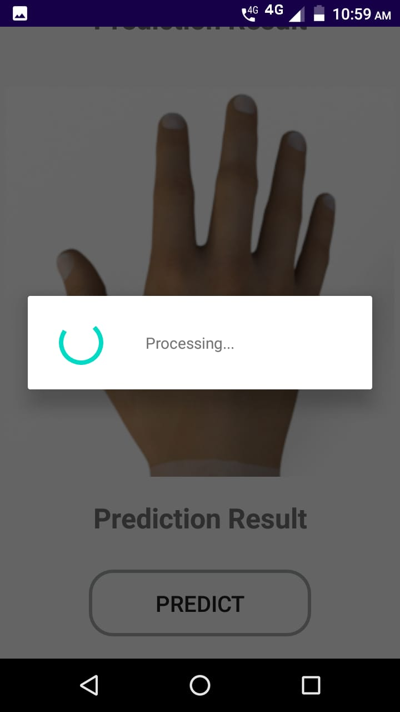

## Let's play Rock, Paper and Scissors

### Description

Develop an Android app which detects whether a hand gesture is Rock, Paper or 
Scissors

### Prerequisties
You need an Android Studio with the SDK to run this project.

### Installation

1. Clone the project from github and 
open it in Android Studio or any editor supporting android developement.

2. The project is build on **gradel** hence all required dependencies will be 
downloaded automatically.

### Run the aap
1. To run the aap in your mobile first make sure that the build is successful.

2. Turn on the developer's mode of your android phone and connect it with the 
laptop using usb.

3. Once the android studio recognize your mobile phone click on the run button
to install the app on the phone.

### How to use the app
1. The task of this aap is to take the one or multiple images and predict the 
result.

2. On successful launch of the app it will ask for user permission.
Provide the permission.
 
3. The aaplication can take 1-6 images at a time. To select the images first 
you need to select number of images. To select the number of images click on 
the spinner present on the screen of the aap.

4. A drop-down will appear. Select the number of images use want to process at 
a time from the list.

5. On selecting the number of images from drop-down the app will display that 
many areas for inserting the images. Scroll down to view all the places.

6. Click on every image area and select the image from the gallery.

7. Once you load all the images a **Predict** button appear on the screen.

8. Click on the button to predict the result and wait for the task to get 
completed.

9. For every image the result is displayed just below the image.

### Application Flow

1. When the user clicks on the **Predict** button the background program takes
the images from the every image view in **Bitmap**.
 
2. It then converts the image to a specific dimension i.e **300 * 300** and stores 
every image in the **List**.

3. Then this list is passed to an **AsyncTask** for performing the
operations in background of the application. The prediction part is heavy hence 
it is down on the another thread other then the main thread of the application.

4. In AsyncTask first an object of the Classifier is created. Here the trained
model is loaded to the tensorFlow, an inputBuffer for image and an outputBuffer
for result is initialized.  

5. Then the image list is passed to **recognizeImage** function. The function takes
the list as an input. For every image present in the list it perfroms some task.
    
    1. It normalize the image by dividing each pixel by 255. 
    2. Then it loads the image to TensorImage.
    3. On successful loading of image it runs the tensorFlow interpreter to
    predict the result. The result of the model is a float array of 16 length.
    
6. The **recognizeImage** function prepares an output-list of model result for 
all the images present in the input-list.

7. For every float array present in the output-list **euclidean** distance is calculated.

8. To calculate the euclidean distance first **rps_vecs.tsv** and **rps_labels** 
files are read and the content of the files are stored in a separate list. This
is down so that the files are read only once in the program.  

9. Every array present in the output-list represents an output of 
the model for an image. 

10. Every single float array is processed  for all the row present in the 
rps_vecs.tsv file and distance for every row is stored in a list along
with the label of that row, present in rps_labels.tsv.

11. Then the list is sorted based on the distance. The label for the lowest
distance is the output for a particular image.
    
        For `0 → Rock, 1 → Paper, 2 → Scissors`
   
12. The output for an image is displayed in the UI just below the image.

### Images

